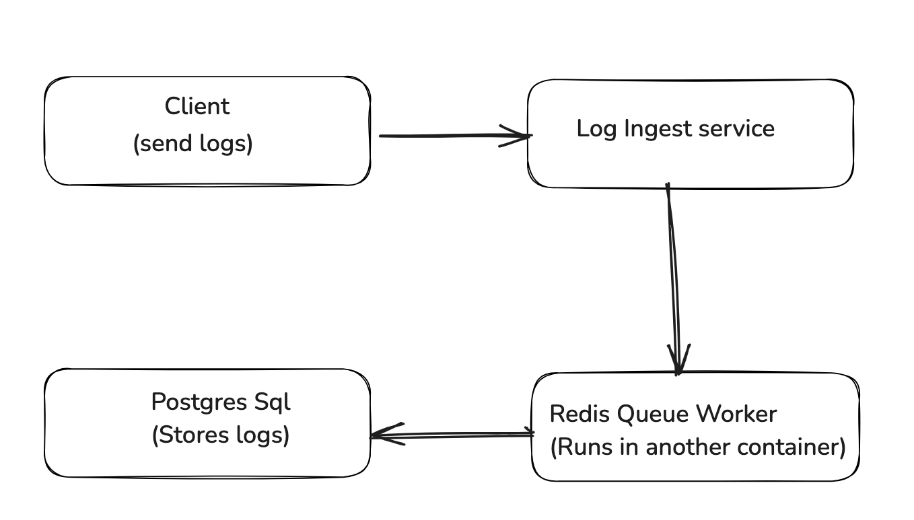

# Log Aggregation Service

A **scalable log aggregation and analysis system** designed to handle logs from multiple microservices across different environments (**development, staging, production**).

## Features
- **Log ingestion via HTTP POST requests** (JSON format)
- **Full-text search** with PostgreSQL `GIN` indexing
- **Filtering** by timestamp, service name, and log level
- **Aggregation queries** (count logs by service, level)
- **Asynchronous processing** with Redis & RQ
- **Dockerized deployment** with PostgreSQL, Redis, and FastAPI
- **Comprehensive test suite** with pytest

---

## Setup Instructions

### Clone the Repository
```
git clone git@github.com:devanshu001/logging-system.git
cd logging-system
```

### Start Services (Docker)
Ensure Docker and Docker Compose are installed.
Run the application:
```
docker-compose up --build
```

This starts:
- FastAPI server 
- PostgreSQL database 
- Redis queue 
- RQ worker
- Test suite

### API Endpoints
1. **Ingest Logs** - POST /logs
Request Body:
```
{
  "timestamp": "2025-01-31T10:00:00Z",
  "level": "ERROR",
  "message": "Connection timeout",
  "service": "payment-service"
}
```
Response:
```
{"status": "Log queued successfully"}
```

2. **Query Logs** - GET /logs

Query Parameters:

| Parameter | Type | Description |
| --- | --- | --- |
| `start_time` | datetime | List all *new or modified* files |
| `end_time` | datetime | Show file differences that **haven't been** staged |
| `service` | string | Filter by service name |
| `level` | string | Filter by log level (INFO, ERROR, etc.) |
| `search` | string | Full-text search |

Example
```
GET /logs?service=payment-service&level=ERROR
```

Response:
```
[
  {
    "timestamp": "2025-01-31T10:00:00Z",
    "level": "ERROR",
    "message": "Connection timeout",
    "service": "payment-service"
  }
]
```

3. **Aggregation** - GET /logs/aggregations

Response:
```
[
  { "service": "payment-service", "level": "ERROR", "count": 10 },
  { "service": "auth-service", "level": "INFO", "count": 15 }
]
```

4. **Health Check** - GET /healthz

## Architecture Overview
**Tech Stack**
- Backend: FastAPI (Python)
- Database: PostgreSQL (with GIN indexing)
- Queue: Redis + RQ (for async log processing)
- Deployment: Docker + Docker Compose

**Design Decisions**
- Why PostgreSQL?
Full-text search with GIN index
Efficient querying for logs
Scalability (supports partitions, indexes)
- Why Redis Queue?
Decouples log ingestion from storage
Prevents slow database writes from blocking API requests
Supports workers for parallel processing
- Why FastAPI?
Asynchronous support
High performance
Easy request validation (Pydantic)


